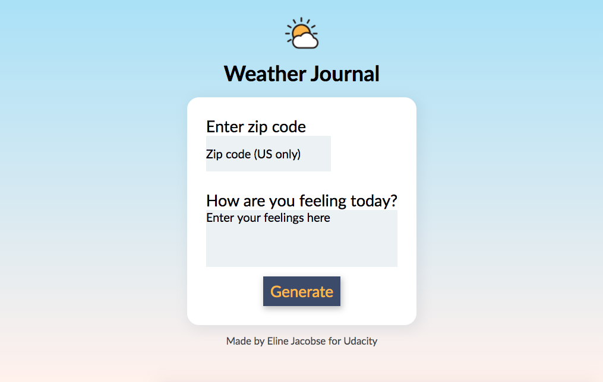

# Weather Journal App Project :sunny:

Project three of Udacity's Frontend Developer Nanodegree. 

## Overview
From the course: "This project requires you to create an asynchronous web app that uses Web API and user data to dynamically update the UI."

For this project I used the [OpenWeatherMap API](https://openweathermap.org/api) to get current weather info based on the user's zip code. The user can input their zip (US only) and enter their feelings, which will generate a journal entry. This entry includes the current date, temperature at the location they entered and the text the user wrote. 

## Preview



## Instructions

To run the app locally, you'll have to install Node.js. It uses the following packages:
- Express
- Cors
- Body-parser

You can install these packages in the terminal by running the following command, replacing `[package name]` with the name of the package. 
```
npm install [package name]
```

Once everything is installed, you can run the app with this command
```
node server.js
```
This should start a local server. Navigate to `localhost:8080` in your web browser and you're all set! 


## Credits :partly_sunny:
- Weather icons by [Sihan Li](https://www.iconfinder.com/Neolau1119)
- Background by [Webgradients](https://webgradients.com/)
- Favicon generated with [favicon.io](https://favicon.io/)